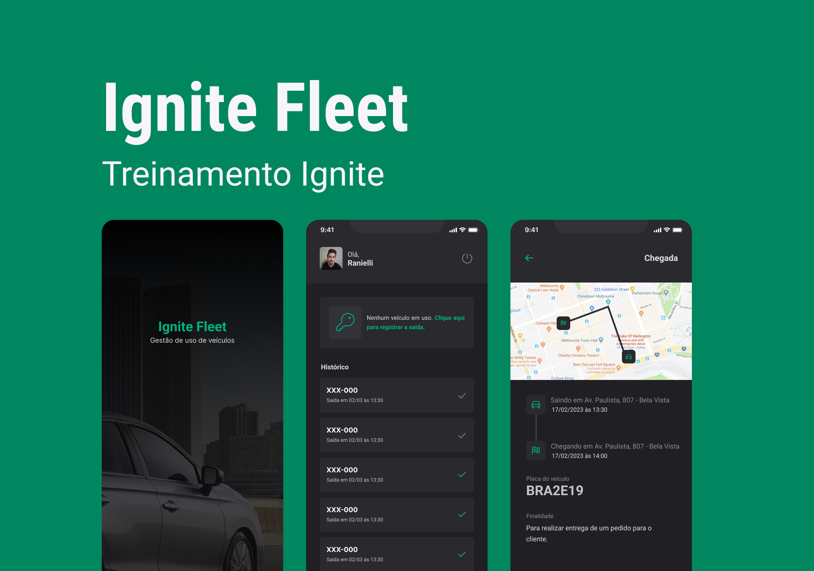

<div align="center">
  <h1 style={{ margin: 0 }}>Ignite Fleet</h1>
  <p style={{ marginTop: 0 }}>
    Projeto desenvolvido durante o curso Ignite da Rocketseat.
  </p>
  
</div>

# Ignite Fleet Fork

## 📝 Sobre (ES)

Este proyecto es un **fork** de la aplicación Ignite Fleet, originalmente desarrollada por [@raniellimontagna](https://github.com/raniellimontagna). Ha sido adaptado, mantenido y mejorado por el equipo de desarrollo de **Agiotech de México** para satisfacer necesidades internas.

Ignite Fleet es una aplicación que facilita la gestión de viajes. Permite a los usuarios:

* Registrarse con su cuenta de Google.
* Agregar vehículos por número de placa con descripción.
* Establecer rutas con punto de salida y llegada.
* Registrar y consultar el historial completo de viajes.

## 🔖 Funcionalidades (ES)

* Autenticación con Google
* Registro y visualización de viajes
* Almacenamiento local y en la nube
* Tareas en segundo plano (background)
* Vista de mapas con rutas
* Historial de trayectos

## 🎨 Layout (ES)

El diseño de la aplicación fue realizado por el equipo de Rocketseat y está disponible en Figma:

➡️ [Diseño en Figma](#) *(agrega el enlace si lo tienes disponible)*

## 🚀 Tecnologías (ES)

* React Native
* Expo
* Expo-location
* Expo-task-manager
* TypeScript
* Styled Components
* React Navigation
* Async Storage
* Realm
* Google Sign-In

> 📦 Consulta el archivo `package.json` para ver todas las dependencias utilizadas.

## 📦 Instalación (ES)

### 🚧 Requisitos previos

Debes tener instalado:

* Node.js
* Expo CLI
* Un emulador Android/iOS o un dispositivo físico

Consulta la documentación de React Native para configurar el entorno de desarrollo.

### 🔧 Instrucciones

```bash
# Clona el repositorio
$ git clone https://github.com/tu-usuario/ignite-fleet-fork.git

# Entra en la carpeta del proyecto
$ cd ignite-fleet-fork

# Instala las dependencias
$ yarn install

# Copia el archivo de entorno y configura tus credenciales de Google
$ cp .env.example .env

# Inicia el servidor de desarrollo
$ yarn start
```

## 📄 Licencia (ES)

Este proyecto está bajo la licencia MIT. Consulta el archivo [`LICENSE`](./LICENSE) para más información.

## 👤 Créditos (ES)

* Autor original: [@raniellimontagna](https://github.com/raniellimontagna)
* Mantenido por: [@tu-usuario](https://github.com/CarlosBarreto) para **Agiotech de México**

---

# Ignite Fleet Fork

## 📝 About (EN)

This project is a **fork** of the Ignite Fleet application, originally developed by [@raniellimontagna](https://github.com/raniellimontagna). It has been adapted, maintained, and improved by the **Agiotech de México** development team for internal use.

Ignite Fleet is an app that helps manage travel and vehicles. It allows users to:

* Sign in using their Google account.
* Register vehicles by license plate and description.
* Create routes with departure and arrival points.
* Record and view complete trip history.

## 🔖 Features (EN)

* Google authentication
* Trip creation and viewing
* Local and cloud storage
* Background tasks
* Map display with routes
* Trip history

## 🎨 Layout (EN)

The app layout was designed by the Rocketseat team and can be accessed on Figma:

➡️ [Figma Layout](#) *(add the link if available)*

## 🚀 Technologies (EN)

* React Native
* Expo
* Expo-location
* Expo-task-manager
* TypeScript
* Styled Components
* React Navigation
* Async Storage
* Realm
* Google Sign-In

> 📦 Check `package.json` for all used dependencies.

## 📦 Installation (EN)

### 🚧 Prerequisites

You must have installed:

* Node.js
* Expo CLI
* An Android/iOS emulator or physical device

Refer to React Native documentation to set up your development environment.

### 🔧 Setup

```bash
# Clone the repository
$ git clone https://github.com/your-user/ignite-fleet-fork.git

# Enter the project folder
$ cd ignite-fleet-fork

# Install dependencies
$ yarn install

# Copy environment variables and add your Google credentials
$ cp .env.example .env

# Start the development server
$ yarn start
```

## 📄 License (EN)

This project is under the MIT license. See the [`LICENSE`](./LICENSE) file for more details.

## 👤 Credits (EN)

* Original author: [@raniellimontagna](https://github.com/raniellimontagna)
* Maintained by: [@your-user](https://github.com/CarlosBarreto)
